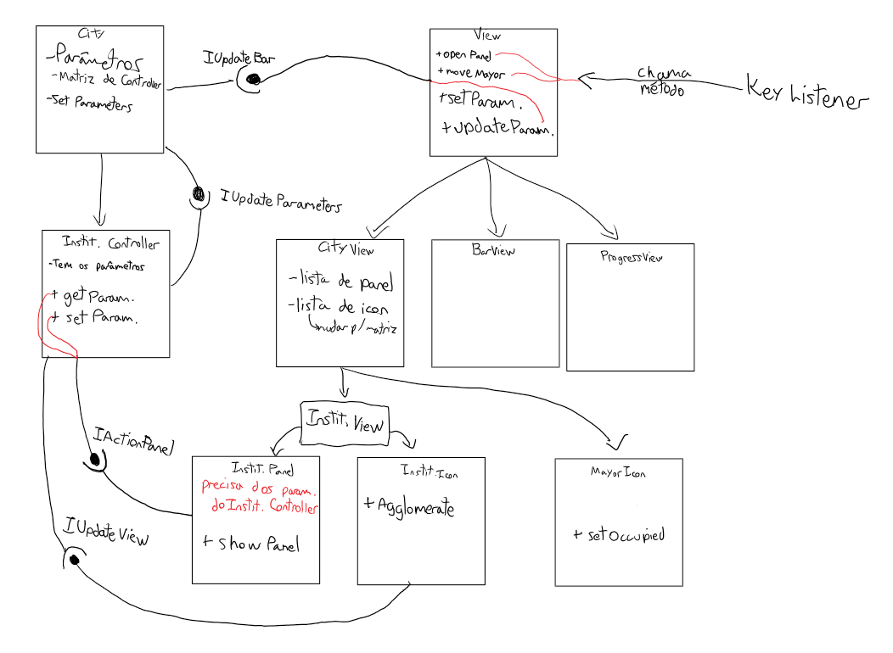
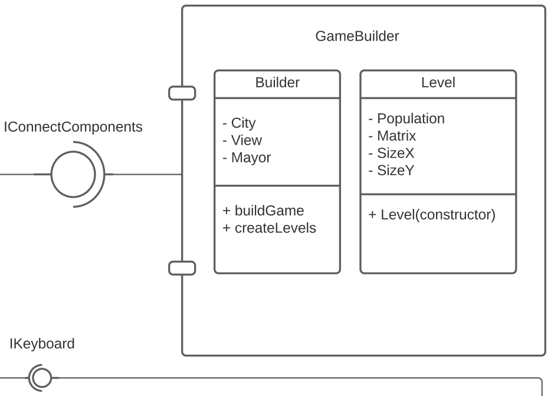
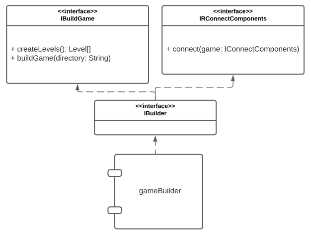
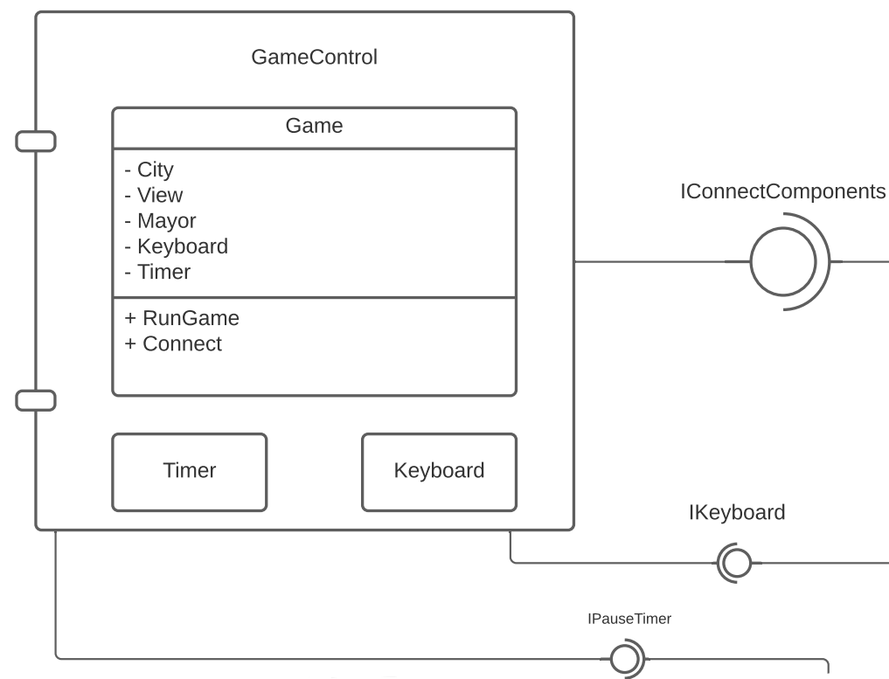
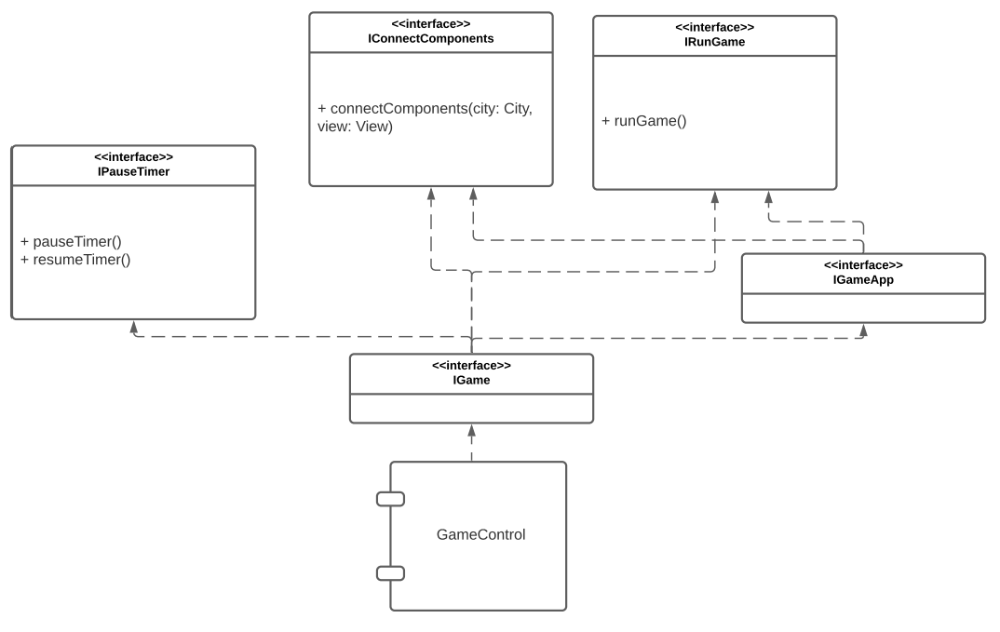
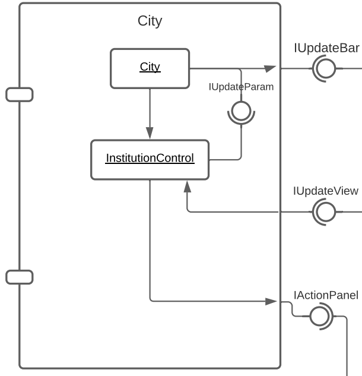
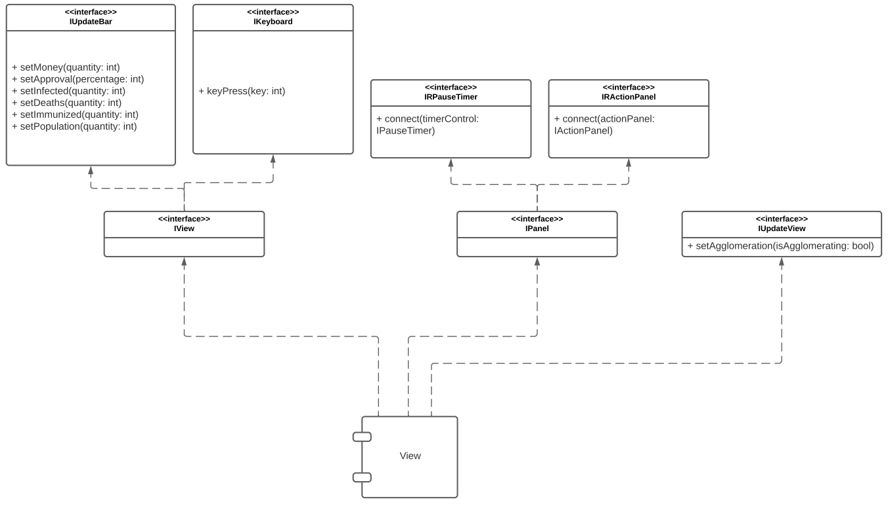
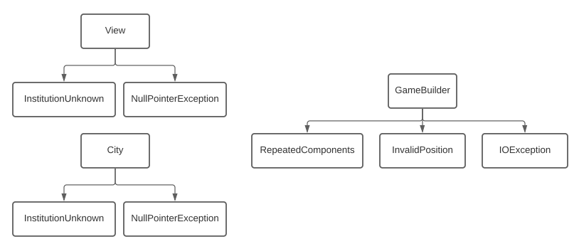

# Projeto `Pandemia Simulator`

# Descrição Resumida do Projeto/Jogo

> O Pandemia Simulator consiste em um mapa quadriculado de tamanho variável que representa
uma cidade em um momento de pandemia. O agente principal é o prefeito, que caminha pela cidade a fim
de gerir os recursos necessários para a imunização da população, que é o objetivo principal do jogo. Para
isso, o jogador deve lidar com eventos como o investimento em vacinas, a aglomeração nas casas, a
paralisação das empresas/indústrias e, consequentemente, manejar os recursos monetários necessários
para conter o vírus de maneira que este não contamine a população inteira, que a cidade não colapse
economicamente ou que este não seja destituído por uma aprovação baixa.

# Equipe
* `<Leonardo de Queiroz Borges>` - `<177829>`
* `<Lucas Eduardo Ramos De Oliveira>` - `<182333>`

# Vídeos do Projeto

## Vídeo da Prévia
> [Link para o vídeo](assets/Pandemia%20Simulator%20-%20Prévia.mp4)

## Vídeo do Jogo
> [Link para o vídeo](assets/Pandemia%20Simulator%20-%20Jogo.mp4)

# Slides do Projeto

## Slides da Prévia
> [Link para os slides](assets/Pandemia%20Simulator%20-%20Prévia.pdf)

## Slides da Apresentação Final
> [Link para os slides](assets/Pandemia%20Simulator%20-%20Jogo.pdf)

## Relatório de Evolução

> Durante o projeto encontramos muita dificuldade em relação à nossa arquitetura, de início tentamos usar o MVC ( Model-View-Controller), mas por nao 
> ter muita familiariedade  optamos de apenas nos basear nessa arquitetura e adptar para o nosso problema. Após semanas chegamos em um primeiro design do nosso projeto
> , mas que após o início da escrita do código tivemos que mudar para melhor leitura do código. Encontramos dificuldades em relação às interfaces e por isso 
> a mudança de diagrama. Aprendemos que o tempo que gastamos pensando na arquitetura nos ajudou muito futaramente em relação a todo o código, pois qualquer problema que acontecia no código,
> resolveríamos facilmente, pois saberiámos exatamente onde ele se encontrava devido à nossa arquitetura. Isso fica muito evidente na nossa estrutura de pastas: todas as nossas
> classes estão na pasta "com", em que estão separadas as classes que controlam os parâmetros em "city" e as que controlam a visualização em "view". A construção do jogo, a escolha de fases e a execução 
> estão, respectivamente, nas pastas "gameBuilder", "gameStart" e "gameControl".

# Destaques de Código

> Nosso método buildGame da classe Builder é responsável por gerar os objetos City e View e conectar as interfaces entre eles. Utilizamos a sobrecarga de métodos nos métodos connect() para simplificar o código,
> e utilizamos polimorfismo na criação das instituições lidas da matriz para a atribuição dos parâmetros e as conexões necessárias para o funcionamento do jogo.

~~~java
public void buildGame(Level level){
        ...

                    city.connect(view); // Conecta a interface IUpdateBar para a atualização das barras de progresso
                    city.connectTimer((IPauseTimer)game); // Conecta o timer para o controle do tempo pela cidade
                    city.setPopulation(population);
                    city.buildMatrix(sizeX, sizeY);
            
                    view.setPopulation(population);
                    view.setCitySize(sizeX, sizeY);
                    view.getWarnPanel().connect((IPauseTimer) game); // Conecta o timer ao painel de avisos, para que o jogo pause a execução caso haja algum aviso.
            
                    for(int y = 0; y < sizeY; y++){
                    for(int x = 0; x < sizeX; x++){
                    if(matrix[y][x] != '-' && matrix[y][x] != 'P'){
                    InstitutionControl institutionControl = city.insert(x, y, matrix[y][x]);
                    institutionControl.connect(city); // Conecta a interface IUpdateParameters ao Control para que este possa atualizar métodos da cidade.
            
                    InstitutionView institutionView = view.insert(x, y, matrix[y][x]);
                    institutionView.getInstitutionPanel().connect((IPauseTimer) game); // Conecta o timer ao painel para que o jogo não continue quando o usuário queira mexer em um parâmetro.
                    institutionView.getInstitutionPanel().connect(institutionControl); // Conecta o Control ao painel para permitir que o usuário mude parâmetros através do painel da instituição.
            
                    institutionControl.connect(institutionView.getInstitutionIcon()); // Conecta o icon ao Control para que o icon seja atualizado caso o control mande.
                } else if(matrix[y][x] == 'P'){
                    mayorX = x;
                    mayorY = y;
                }
            }
        }
        view.setMayor(mayorX, mayorY);
        game.connectComponents(city, view); // conecta o city e o view gerados pelo Builder ao game para a execução.

        city.startUpdate();
        }
~~~

# Conclusões e Trabalhos Futuros

> É, possível, dizer que atendemos aos objetivos propostos do trabalho como: apresentar uma boa arquitetura do sistema, explorar os princípios de orientação a objeto com o grande uso 
> de polimorfimo e também de interface, utilização de plano de exceções, além de uma interface gráfica totalmente produzida pelo nosso grupo. Sentimos muito pela falta de tempo, pois 
> gostaríamos de no futuro acrescentar novas instituíções em nosso projeto, o que levaria a colocar novos algoritmos e novas relações entre nossas instituíções, por exemplo, manifestações
>  que poderiam ocorrer, oferta de vacina de países diferentes (com uma chance da vacina nao ser funcional), uma inserção de um aeroporto na cidade ou até mesmo estádios pelo mapa representando o lazer 
> da população. Todas essas atualizações poderiam ser facilmente implementadas devido a nossa organização de código, com isso aprendemos o grande valor que uma organização tem para o futuro,
> ou seja, nossa arquitetura é a grande responsável da facilidade da expansão do nosso jogo.

# Documentação dos Componentes

# Diagramas

## Diagrama Geral do Projeto

> Para a estruturação e o desenvolvimento do jogo, decidiu-se usar uma modificação do estilo arquitetural Model View Controller, em que temos uma componente que controla toda a parte de visualização do projeto, para que seja facilmente adaptada depois, e outra componente que controla os parâmetros e ações dos atores.

## Diagrama Geral de Componentes

Este é o diagrama compondo os componentes do jogo:

## Componente `GameBuilder`

> Esse componente é responsável por gerar os objetos que compõem o fluxo do jogo, solicitar a criação das instituições necessárias na componente City
> de acordo com um arquivo .csv e conectar as interfaces.

**Ficha Técnica**
item | detalhamento
----- | -----
Pacote | `com.gameBuilder`
Autores | `Lucas e Leonardo`
Interfaces | `IRConnectComponents`   `IBuildGame`   `IBuilder`

### Interfaces

Interfaces associadas a esse componente:

Interface agregadora do componente em Java:

~~~java
public interface IBuilder extends IBuildGame, IRConnectComponents{
}
~~~

## Detalhamento das Interfaces

### Interface `IBuildGame`

Interface que permite acesso ao método buildGame para montagem do jogo.

~~~java
public interface IBuildGame {
    void buildGame(String directory);
}
~~~

Método | Objetivo
-------| --------
`buildGame` | Permite a montagem do jogo de acordo com o diretório dado.

### Interface `IRConnectComponents`

Interface que conecta a interface IConnectComponents à classe Builder.

~~~java
import com.gameControl.IConnectComponents;

public interface IRConnectComponents {
    void connect(IConnectComponents com);
}
~~~

Método | Objetivo
-------| --------
`connect` | Conecta o parâmetro "com" da classe Builder à interface IConnectComponents.

## Componente `GameStart`

> Esse componente é responsável por gerar o painel de escolha do nível do jogo e executar o resto com base nessa escolha.

**Ficha Técnica**
item | detalhamento
----- | -----
Pacote | `com.gameStart`
Autores | `Lucas e Leonardo`
Interfaces | `ILevels`

### Interfaces

Interfaces associadas a esse componente:

## Detalhamento das Interfaces

### Interface `ILevels`

Interface que permite a escolha de level para o gameStart.

~~~java
package com.gameStart;

public interface ILevel {
    void chooseLevel(int level);
}
~~~

Método | Objetivo
-------| --------
`chooseLevel` | Método chamado pelo painel de escolha do level para executar o resto do jogo.

## Componente `GameControl`

> <Esse componente é responsável por controlar as ações e o fluxo do jogo, contém o Timer e o KeyboardListener.>

**Ficha Técnica**
item | detalhamento
----- | -----
Classe | `com.gameControl`
Autores | `Lucas e Leonardo`
Interfaces | `IConnectComponents`   `IPauseTimer`   `IRunGame`   `IGameApp`   `IGame`

### Interfaces

Interfaces associadas a esse componente:

Interface agregadora do componente em Java:

~~~java
public interface IGame extends IRunGame, IConnectComponents, IPauseTimer, IGameApp{
}
~~~

## Detalhamento das Interfaces

### Interface `IPauseTimer`

Interface que contém o método que é responsável por pausar a execução do Timer.

~~~java
public interface IPauseTimer {
    void pauseTimer();
    void resumeTimer();
}
~~~

Método | Objetivo
-------| --------
`pauseTimer` | pausa a execução do timer.
`resumeTimer` | volta a execução do timer.

### Interface `IConnectComponents`

Interface que provém o método necessário para ligar os componentes criados pelo Builder às variáveis que estão em Game.

~~~java
public interface IConnectComponents {
    void connectComponents(City city, View view);
}
~~~

Método | Objetivo
-------| --------
`connectComponents` | conecta os ponteiros recebidos pelos parâmetros às variáveis de Game.

### Interface `IRunGame`

Interface que contém o método que é responsável por executar o jogo.

~~~java
public interface IRunGame {
    void runGame();
}
~~~

Método | Objetivo
-------| --------
`runGame` | executa o jogo.

### Interface `IGameApp`

Interface agregadora que contém os métodos necessários pela Main para execução e conexão do jogo.

~~~java
public interface IGameApp extends IRunGame, IConnectComponents{
}
~~~

## Componente `City`

> <Esse componente é responsavel por guarda o tabuleiro do jogo, contém os controllers de cada instituição.>

**Ficha Técnica**
item | detalhamento
----- | -----
Classe | `com.city`
Autores | `Lucas e Leonardo`
Interfaces | `IUpdateParameters`   `IRUpdateParameters`   `IRUpdateBar`   `IRUpdateView`   `IActionPanel` 

### Interfaces

Interfaces associadas a esse componente:

Interface agregadora do componente em Java:

~~~java
public interface ICity extends IRUpdateBar, IUpdateParameters {
}
~~~

## Detalhamento das Interfaces

### Interface `IUpdateParameters`

Contém os métodos de atualização dos parâmetros de City.

~~~java
public interface IUpdateParameters {
    void updateMoney(int quantityDelta);
    void updateApproval(int quantityDelta);
    void updateInfected(int quantityDelta);
    void updateImmunized(int quantityDelta);
    void updateDeaths(int quantityDelta);
    int getPopulationActive();
}
~~~

Método | Objetivo
-------| --------
`updateMoney` | Método que permite a atualização do parâmetro Money de City pelo InstitutionView.
`updateApproval` | Método que permite a atualização do parâmetro Approval de City pelo InstitutionView.
`updateInfected` | Método que permite a atualização do parâmetro Infected de City pelo InstitutionView.
`updateImmunized` | Método que permite a atualização do parâmetro Immunized de City pelo InstitutionView.
`updateDeaths` | Método que permite a atualização do parâmetro Deaths de City pelo InstitutionView.
`getPopulationActive` | Método que retorna a população ativa que pode ser infectada.

### Interface `IRUpdateBar`

Interface que conecta a classe City à interface IUpdateBar para que City consiga atualizar as barras de progresso de View.

~~~java
public interface IRUpdateBar {
    void connect(IUpdateBar barControl);
}
~~~

Método | Objetivo
-------| --------
`connect` | Conecta a interface IUpdateBar à variavel barControl de City.

### Interface `IActionPanel`

Contém ações que o usuário pode fazer através do painel de cada instituição, quando este abrí-lo.

~~~java
public interface IActionPanel {
    void invest(int quantity);
    void limitOccupation(int percentage);
    void stopAgglomeration();
    int getParameter(char type);
}
~~~

Método | Objetivo
-------| --------
`invest` | Investe uma quantidade de dinheiro em uma determinada instituição.
`limitOccupation` | Limita a ocupação de uma determinada instituição.
`stopAgglomeration` | Intervém em alguma aglomeração que pode estar ocorrendo no local, para não aumentar a taxa de infecção.
`getParameter` | Obtém os dados de um certo parâmetro contido em alguma instituição.

### Interface `IRUpdateView`

Interface que conecta a interface IUpdateView à classe InstitutionView, para permitir o acesso aos métodos.

~~~java
public interface IRUpdateView {
    void connect(IUpdateView viewUpdate);
}
~~~

Método | Objetivo
-------| --------
`connect` | Método que conecta a interface IUpdateView à variável viewUpdate de InstitutionView.

### Interface `IRUpdateParameters`

Interface que conecta a interface IUpdateParameters à classe InstitutionView, para permitir o acesso aos métodos de atualização de parâmetros da City.

~~~java
public interface IRUpdateParameters {
    void connect(IUpdateParameters cityParameters);
}
~~~

Método | Objetivo
-------| --------
`connect` | Método que conecta a interface IUpdateParameters à variável cityParameters de InstitutionView.

### Interface `IInstitutionControl`

Interface agregadora de Institution Control, que agrega as interfaces necessárias.

~~~java
public interface IInstitutionControl extends IRUpdateParameters, IRUpdateView, IActionPanel{
}
~~~

## Componente `View`

> <Esse componente é responsavel por toda parte gráfica do código, possui um tabuleiro de views especificos, além de um BarView e Prefeito com.view.>

**Ficha Técnica**
item | detalhamento
----- | -----
Classe | `com.view`
Autores | `Lucas e Leonardo`
Interfaces | `IUpdateBar`   `IUpdateView`   `IRPauseTimer`   `IRActionPanel`   `IKeyboard` 

### Interfaces

Interfaces associadas a esse componente:

Interface agregadora do componente em Java:

~~~java
public interface IView extends IKeyboard, IUpdateBar{
}
~~~

## Detalhamento das Interfaces

### Interface `IUpdateBar`

Interface que disponibiliza os métodos de atualização dos parâmetros de View para que as barras de progresso se atualizem.

~~~java
public interface IUpdateBar {
    void setMoney(int quantity);
    void setApproval(int percentage);
    void setDeaths(int quantity);
    void setInfected(int quantity);
    void setImmunized(int quantity);
    void setPopulation(int quantity);
}
~~~

Método | Objetivo
-------| --------
`setMoney` | Configura a variável "money" de View com o valor passado por parâmetro, para atualização.
`setApproval` | Configura a variável "approval" de View com o valor passado por parâmetro, para atualização.
`setDeaths` | Configura a variável "deaths" de View com o valor passado por parâmetro, para atualização.
`setInfected` | Configura a variável "infected" de View com o valor passado por parâmetro, para atualização.
`setImmunized` | Configura a variável "immunized" de View com o valor passado por parâmetro, para atualização.
`setPopulation` | Configura a variável "population" de View com o valor passado por parâmetro, para atualização.

### Interface `IKeyboard`

Interface que disponibiliza as ações que o Mayor pode fazer no View.

~~~java
public interface IKeyboard {
    void keyPress(int key);
}
~~~

Método | Objetivo
-------| --------
`keyPress` | Executa as ações correspondentes à tecla pressionada.

### Interface `IRPauseTimer`

Interface que conecta a classe City à interface IPauseTimer para que City consiga pausar a execução do jogo.

~~~java
public interface IRPauseTimer {
    void connect(IPauseTimer timerControl);
}
~~~

Método | Objetivo
-------| --------
`connect` | Conecta a interface IPauseTimer à variavel timerControl de cada painel.

### Interface `IRActionPanel`

Interface que conecta a interface ActionPanel à classe InstitutionPanel respectiva.

~~~java
public interface IRActionPanel {
    void connect(IActionPanel actionPanel);
}
~~~

Método | Objetivo
-------| --------
`connect` | Conecta a interface IActionPanel, implementada pela classe InstitutionController, à classe InstitutionPanel, para que o painel consiga acessar métodos do controle.

### Interface `IPanel`

Interface agregadora que junta as interfaces implementadas por cada painel de instituição.

~~~java
public interface IPanel extends IRActionPanel, IRPauseTimer, WindowListener {
}
~~~

### Interface `IUpdateView`

Interface que disponibiliza os métodos de atualização dos parâmetros de cada InstitutionView para que os detalhes se atualizem.

~~~java
public interface IUpdateView {
    void setAgglomeration(boolean isAgglomerating);
}
~~~

Método | Objetivo
-------| --------
`setAgglomeration` | Comunica se a instituição está aglomerando, para que o View mude o ícone mostrado na tela.

# Plano de Exceções

## Diagrama da hierarquia de exceções
`O diagrama abaixo mostra a hierarquia do plano de exceções montado para o projeto.`

## Descrição das classes de exceção

Classe | Descrição
----- | -----
View | Engloba todas as exceções ocorridas na visualização do jogo.
InstitutionUnknown | Indica um caractere de instituição inexistente na leitura do CSV.
NullPointerException | Indica que o arquivo não existe ou o caminho está errado.
City | Engloba todas as exceções ocorridas na criação dos controladores de parâmetros para cada instituição.
GameBuilder | Engloba todas as exceções de construção.
InvalidPosition | Indica uma posição inválida.
RepeatedComponents | Indica que há a tentativa de inserir dois objetos numa posição.
IOException | Indica uma falha na leitura do arquivo CSV.
