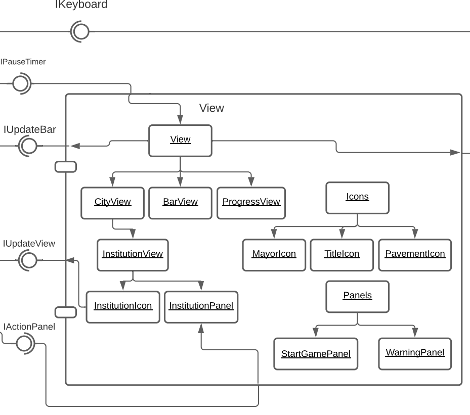

# Projeto `Pandemia Simulator`

# Descrição Resumida do Projeto/Jogo

> O Pandemia Simulator consiste em um mapa quadriculado de tamanho variável que representa
uma cidade em um momento de pandemia. O agente principal é o prefeito, que caminha pela cidade a fim
de gerir os recursos necessários para a imunização da população, que é o objetivo principal do jogo. Para
isso, o jogador deve lidar com eventos como o investimento em vacinas, a aglomeração nas casas, a
paralisação das empresas/indústrias e, consequentemente, manejar os recursos monetários necessários
para conter o vírus de maneira que este não contamine a população inteira, que a cidade não colapse
economicamente ou que este não seja destituído por uma aprovação baixa.

# Equipe
* `<Leonardo de Queiroz Borges>` - `<177829>`
* `<Lucas Eduardo Ramos De Oliveira>` - `<182333>`

# Vídeos do Projeto

## Vídeo da Prévia
> [Link para o vídeo](https://drive.google.com/file/d/1Jy8ckKvVrpeEhBOrAJIAfLVy8HdCP8GC/view?usp=sharing)

# Slides do Projeto

## Slides da Prévia
> [Link para os slides](https://drive.google.com/file/d/1ruOlYLg5hwbdd_i3FqVQaLBlXTQcqdt0/view?usp=sharing)

# Documentação dos Componentes

# Diagramas

## Diagrama Geral do Projeto

> Para a estruturação e o desenvolvimento do jogo, decidiu-se usar uma modificação do estilo arquitetural Model View Controller, em que temos uma componente que controla toda a parte de visualização do projeto, para que seja facilmente adaptada depois, e outra componente que controla os parâmetros e ações dos atores.

## Diagrama Geral de Componentes

Este é o diagrama compondo os componentes do jogo:

## Componente `GameBuilder`

> Esse componente é responsável por gerar os objetos que compõem o fluxo do jogo, solicitar a criação das instituições necessárias na componente City
> de acordo com um arquivo .csv e conectar as interfaces.

**Ficha Técnica**
item | detalhamento
----- | -----
Pacote | `game.gameBuilder`
Autores | `Lucas e Leonardo`
Interfaces | `IRConnectComponents`

### Interfaces

Interfaces associadas a esse componente:

## Detalhamento das Interfaces

### Interface `IRConnectComponents`

Interface que conecta a interface IConnectComponents à classe Builder.

~~~java
import game.gameController.IConnectComponents;

public interface IRConnectComponents {
    void connect(IConnectComponents game);
}
~~~

Método | Objetivo
-------| --------
`connect` | Conecta o parâmetro "game" da classe Builder à interface IConnectComponents.

## Componente `GameController`

> <Esse componente é responsável por controlar as ações e o fluxo do jogo, contém o Timer e o KeyboardListener.>

**Ficha Técnica**
item | detalhamento
----- | -----
Classe | `game.gameController`
Autores | `Lucas e Leonardo`
Interfaces | `IConnectComponents`  

### Interfaces

Interfaces associadas a esse componente:

## Detalhamento das Interfaces

### Interface `IConnectComponents`

Interface que provém o método necessário para ligar os componentes criados pelo Builder às variáveis que estão em Game.

~~~java
public interface IConnectComponents {
    void connectComponents(City city, Mayor mayor, View view);
}
~~~

Método | Objetivo
-------| --------
`connectComponents` | conecta os ponteiros recebidos pelos parâmetros às variáveis de Game.

## Componente `City`

> <Esse componente é responsavel por guarda o tabuleiro do jogo, contém os controllers de cada instituição.>

**Ficha Técnica**
item | detalhamento
----- | -----
Classe | `game.city`
Autores | `Lucas e Leonardo`
Interfaces | `IRPauseTimer`   `IActionListener`   `IRUpdateBar`   `IRUpdateView`   `IActionPanel` 

### Interfaces

Interfaces associadas a esse componente:

Interface agregadora do componente em Java:

~~~java
public interface IRCityControl extends IRPauseTimer, IRUpdateBar {
}
~~~

## Detalhamento das Interfaces

### Interface `IRPauseTimer`

Interface que conecta a classe City à interface IPauseTimer para que City consiga pausar a execução do jogo.

~~~java
public interface IRPauseTimer {
    void connect(IPauseTimer timerControl);
}
~~~

Método | Objetivo
-------| --------
`connect` | Conecta a interface IPauseTimer à variavel timerControl de City.

### Interface `IRUpdateBar`

Interface que conecta a classe City à interface IUpdateBar para que City consiga atualizar as barras de progresso de View.

~~~java
public interface IRUpdateBar {
    void connect(IUpdateBar barControl);
}
~~~

Método | Objetivo
-------| --------
`connect` | Conecta a interface IUpdateBar à variavel barControl de City.

### Interface `ActionListener`

Contém o método que permite que o Timer avise City a cada tick que ocorre.

~~~java
public interface ActionListener {
    void actionPerformed(ActionEvent timerEvent);
}
~~~

Método | Objetivo
-------| --------
`actionPerformed` | Método que executa uma ação quando recebe o evento do tick do Timer.

### Interface `IActionPanel`

Contém ações que o usuário pode fazer através do painel de cada instituição, quando este abrí-lo.

~~~java
public interface IActionPanel {
    void invest(int quantity);
    void limitOccupation(double percentage);
    void stopAgglomeration();
}
~~~

Método | Objetivo
-------| --------
`invest` | Investe uma quantidade de dinheiro em uma determinada instituição.
`limitOccupation` | Limita a ocupação de uma determinada instituição.
`stopAgglomeration` | Intervém em alguma aglomeração que pode estar ocorrendo no local, para não aumentar a taxa de infecção.

### Interface `IRUpdateView`

Interface que conecta a interface IUpdateView à classe InstitutionView, para permitir o acesso aos métodos.

~~~java
public interface IRUpdateView {
    void connect(IUpdateView viewUpdate);
}
~~~

Método | Objetivo
-------| --------
`connect` | Método que conecta a interface IUpdateView à variável viewUpdate de InstitutionView.

### Interface `IUpdateParameters`

Contém os métodos de atualização dos parâmetros de City.

~~~java
public interface IUpdateParameters {
    void updateMoney(int quantityDelta);
    void updateApproval(double multiplier);
    void updateInfected(int quantityDelta);
    void updateImmunized(int quantityDelta);
}
~~~

Método | Objetivo
-------| --------
`updateMoney` | Método que permite a atualização do parâmetro Money de City pelo InstitutionView.
`updateApproval` | Método que permite a atualização do parâmetro Approval de City pelo InstitutionView.
`updateInfected` | Método que permite a atualização do parâmetro Infected de City pelo InstitutionView.
`updateImmunized` | Método que permite a atualização do parâmetro Immunized de City pelo InstitutionView.

### Interface `IRUpdateParameters`

Interface que conecta a interface IUpdateParameters à classe InstitutionView, para permitir o acesso aos métodos de atualização de parâmetros da City.

~~~java
public interface IRUpdateParameters {
    void connect(IUpdateParameters cityParameters);
}
~~~

Método | Objetivo
-------| --------
`connect` | Método que conecta a interface IUpdateParameters à variável cityParameters de InstitutionView.

## Componente `Mayor`

> <Esse componente é responsavel por guardar tudo o que interessa do nosso ator principal, é estudado a parte.>

**Ficha Técnica**
item | detalhamento
----- | -----
Classe | `game.mayor`
Autores | `Lucas e Leonardo`
Interfaces | `IRMayorAction`   `IMove`   

### Interfaces

Interfaces associadas a esse componente:

## Detalhamento das Interfaces

### Interface `IMove`

Interface que contém os métodos que permitem que o prefeito se mova ou execute um comando.

~~~java
public interface IMove {
    void move(char command);
}
~~~

Método | Objetivo
-------| --------
`move` | Executa um comando no Mayor, seja para se movimentar, seja para abrir um painel.

### Interface `IRMayorAction`

Interface que conecta a interface IMayorAction à classe Mayor, para permitir que Mayor execute ações no View.

~~~java
public interface IRMayorAction {
    void connect(IMayorAction viewAction);
}
~~~

Método | Objetivo
-------| --------
`connect` | Conecta a interface IMayorAction à variável viewAction da classe Mayor.

## Componente `View`

> <Esse componente é responsavel por toda parte gráfica do código, possui um tabuleiro de views especificos, além de um BarView e Prefeito game.view.>

**Ficha Técnica**
item | detalhamento
----- | -----
Classe | `game.view`
Autores | `Lucas e Leonardo`
Interfaces | `IUpdateBar`   `IUpdateView`   `IRActionPanel`   `IMayorAction` 

### Interfaces

Interfaces associadas a esse componente:

Interface agregadora do componente em Java:

~~~java
public interface IUpdateAndAction extends IUpdateBar, IMayorAction {
}
~~~

## Detalhamento das Interfaces

### Interface `IUpdateBar`

Interface que disponibiliza os métodos de atualização dos parâmetros de View para que as barras de progresso se atualizem.

~~~java
public interface IUpdateBar {
    void setMoney(int quantity);
    void setApproval(double percentage);
    void setInfected(int quantity);
    void setImmunized(int quantity);
}
~~~

Método | Objetivo
-------| --------
`setMoney` | Configura a variável "money" de View com o valor passado por parâmetro, para atualização.
`setApproval` | Configura a variável "approval" de View com o valor passado por parâmetro, para atualização.
`setInfected` | Configura a variável "infected" de View com o valor passado por parâmetro, para atualização.
`setImmunized` | Configura a variável "immunized" de View com o valor passado por parâmetro, para atualização.

### Interface `IMayorAction`

Interface que disponibiliza as ações que o Mayor pode fazer no View.

~~~java
public interface IMayorAction {
    void openPanel();
    void move(int x, int y);
}
~~~

Método | Objetivo
-------| --------
`openPanel` | Solicita a abertura do painel da instituição em que o Mayor está.
`move` | Passa x e y para MayorView atualizar sua posição na tela.

### Interface `IUpdateView`

Interface que disponibiliza os métodos de atualização dos parâmetros de cada InstitutionView para que os detalhes se atualizem.

~~~java
public interface IUpdateView {
    void setAgglomeration(boolean isAgglomerating);
    void setPanelParameter(char parameter, double bar, int number);
}
~~~

Método | Objetivo
-------| --------
`setAgglomeration` | Comunica se a instituição está aglomerando, para que o View mude o ícone mostrado na tela.
`setPanelParameter` | Configura, para cada parâmetro de cada painel, indicado por um char, o valor da barra e o número mostrado na tela. Se um deles não ser necessário, passa-se "-1" como parâmetro.

### Interface `IRActionPanel`

Interface que conecta a interface ActionPanel à classe InstitutionPanel respectiva.

~~~java
public interface IRActionPanel {
    void connect(IActionPanel actionPanel);
}
~~~

Método | Objetivo
-------| --------
`connect` | Conecta a interface IActionPanel, implementada pela classe InstitutionController, à classe InstitutionPanel, para que o painel consiga acessar métodos do controle.

# Plano de Exceções

## Diagrama da hierarquia de exceções
`O diagrama abaixo mostra a hierarquia do plano de exceções montado para o projeto.`

## Descrição das classes de exceção

Classe | Descrição
----- | -----
FileRead | Engloba todas as exceções de leitura não aceitas.
FileNotFound | Indica que o arquivo nao foi achado.
InvalidFormat | Indica que o arquivo esta no formato inválido.
IconRead | Engloba todas as exceções de leitura de imagens.
NameRead | Engloba todas as exceções de nomes nao aceitas.
InvalidCharacter | Indica um caracter inválido.
NameTooLong | Indica um nome muito grande.
NullName | Indica um nome vazio.
GameBuilder | Engloba todas as exceções de construção.
InvalidPosition | Indica uma posição inválida.
TwoOnSamePosition | Indica que há a tentativa dois objetos numa posição.
InvalidInstitution | Indica uma instituição inexistente.
InvalidInstitutionQuantity | Indica uma quantidade de instituição inválida.
