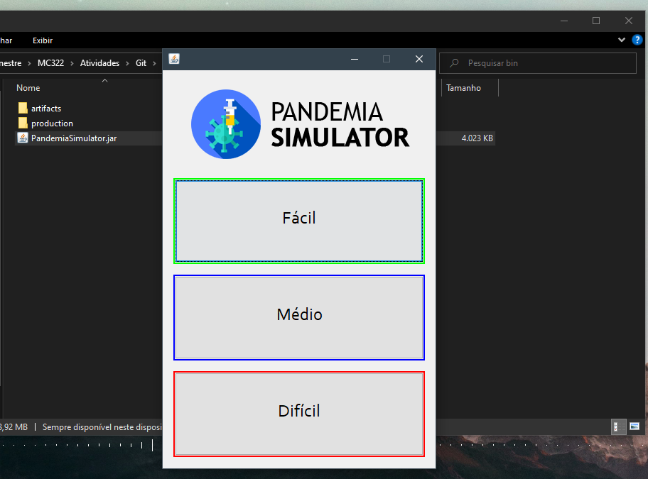

# Projeto `Pandemia Simulator`

# Execução do jogo

> Para executar o jogo, basta entrar na pasta src/bin e executar o arquivo PandemiaSimulator.jar. Ao abrir o arquivo, você tem a opção de escolher entre três níveis de dificuldade:
> fácil, médio ou difícil. Escolha seu nível e divirta-se! Para se movimentar através do tabuleiro, utilize as teclas WASD, e, para entrar em uma instituição, aperte Espaço.

